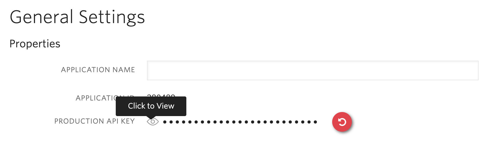

<a  href="https://www.twilio.com">

</a>

# Twilio Account Security Quickstart - Two-Factor Authentication and Phone Verification


> We are currently in the process of updating this sample template. If you are encountering any issues with the sample, please open an issue at [github.com/twilio-labs/code-exchange/issues](https://github.com/twilio-labs/code-exchange/issues) and we'll try to help you.

## About

A simple **PHP**, **Laravel** and **AngularJS** implementation of a website that uses Twilio Account
Security services to protect all assets within a folder. Additionally, it shows a Phone
Verification implementation.

It uses four channels for delivery, SMS, Voice, Soft Tokens, and Push Notifications.
You should have the [Authy App](https://authy.com/download/) installed to try Soft Token
and Push Notification support.

  Implementations in other languages:

| .NET | Java | Node | Python | Ruby |
| :--- | :--- | :----- | :-- | :--- |
| TBD | [Done](https://github.com/TwilioDevEd/account-security-quickstart-spring)  | [Done](https://github.com/TwilioDevEd/account-security-quickstart-node)  | [Done](https://github.com/TwilioDevEd/account-security-quickstart-django) | [Done](https://github.com/TwilioDevEd/account-security-quickstart-rails)  |

### Features

- URL path "/protected" is protected with both user session and Twilio Two-Factor Authentication
- One Time Passwords (SMS and Voice)
- SoftTokens
- Push Notifications (via polling)
- Phone Verification
  - SMS or Voice Call

## Set up

### Requirements

- [PHP >= 7.2.5](https://www.php.net/) and [composer](https://getcomposer.org/)
- A Twilio account - [sign up](https://www.twilio.com/try-twilio)
- The application uses [sqlite3](https://www.sqlite.org/) as the persistence layer. If you don't have it already, you should install it.

### Twilio Account Settings

This application should give you a ready-made starting point for writing your own application.
Before we begin, we need to collect all the config values we need to run the application:

| Config&nbsp;Value | Description                                                                                                                                                  |
| :---------------- | :----------------------------------------------------------------------------------------------------------------------------------------------------------- |
| Account&nbsp;Sid  | Your primary Twilio account identifier - find this [in the Console](https://www.twilio.com/console).                                                         |
| Auth&nbsp;Token   | Used to authenticate - [just like the above, you'll find this here](https://www.twilio.com/console).                                                         |
| Verification&nbsp;Sid |  For Verification Service. You can generate one [here](https://www.twilio.com/console/verify/services) |
| Account Security Api Key  | Create a new Authy application in the [console](https://www.twilio.com/console/authy/). After you give it a name you can view the generated Account Security production API key. This is the string you will later need to set up in your environmental variables.|

### How to get an Authy API Key

You will need to create a new Authy application in the [console](https://www.twilio.com/console/authy/). After you give it a name you can view the generated Account Security production API key. This is the string you will later need to set up in your environmental variables.



### Local development

After the above requirements have been met:

1. Clone this repository and `cd` into it

    ```bash
    git clone git@github.com:TwilioDevEd/account-security-quickstart-php.git
    cd account-security-quickstart-php
    ```

1. Install PHP dependencies

    ```bash
    make install
    ```

1. Set your environment variables

    ```bash
    cp .env.example .env
    ```

    See [Twilio Account Settings](#twilio-account-settings) to locate the necessary environment variables.

1. Run the application

    ```bash
    make serve
    ```

1. Navigate to [http://localhost:8000](http://localhost:8000)

    That's it!

### To try Authy Two-Factor Authentication

Open the following url in your browser: [http://localhost:8000/login](http://localhost:8000/login)

At that point you can test a channel. To test another, simply logout after your success and login again.

### To try Verify Phone Verification

Open the following url in your browser: `http://localhost:8000/verify`

At that point you can test SMS/Phone Calls. To test another, simply logout after your success. You'll be brought back to the index page to try again with the other.

### Unit and Integration Tests

You can run the Unit tests locally by typing:
```bash
vendor/bin/phpunit
```

### Cloud deployment

Additionally to trying out this application locally, you can deploy it to a variety of host services. Here is a small selection of them.

Please be aware that some of these might charge you for the usage or might make the source code for this application visible to the public. When in doubt research the respective hosting service first.

| Service                           |                                                                                                                                                                                                                           |
| :-------------------------------- | :------------------------------------------------------------------------------------------------------------------------------------------------------------------------------------------------------------------------ |
| [Heroku](https://www.heroku.com/) | [](https://heroku.com/deploy)                                                                                                                                       |

## Resources

- The CodeExchange repository can be found [here](https://github.com/twilio-labs/code-exchange/).

## Contributing

This template is open source and welcomes contributions. All contributions are subject to our [Code of Conduct](https://github.com/twilio-labs/.github/blob/master/CODE_OF_CONDUCT.md).

## License

[MIT](http://www.opensource.org/licenses/mit-license.html)

## Disclaimer

No warranty expressed or implied. Software is as is.

[twilio]: https://www.twilio.com
